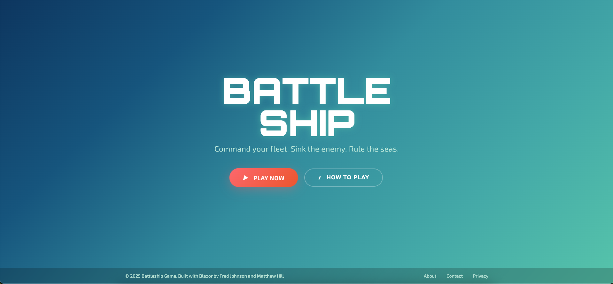
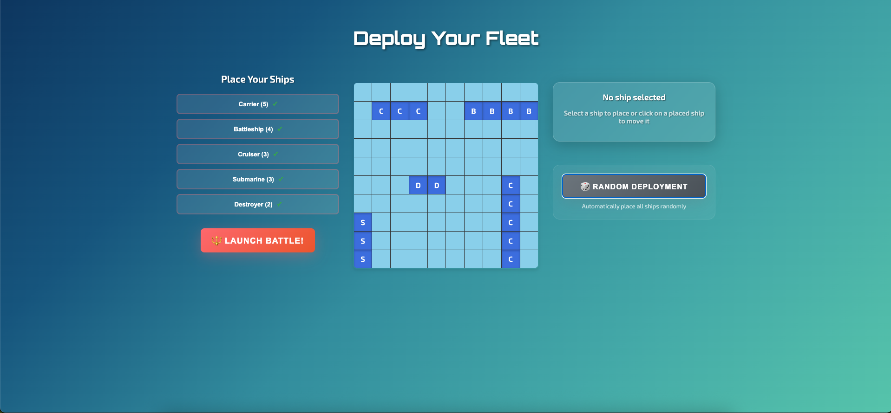
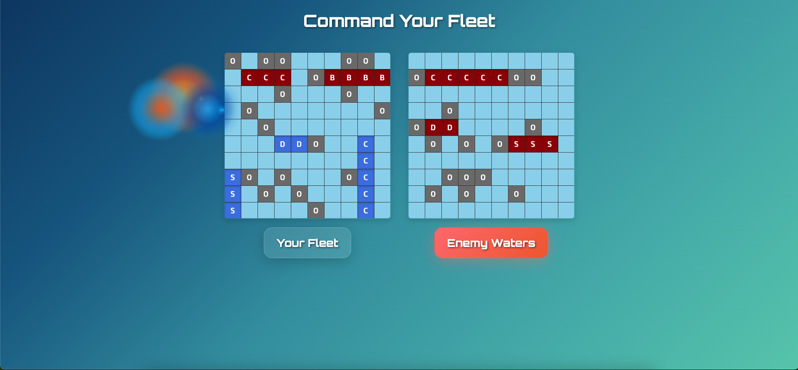

# 🚢 BattleShip



Welcome to BattleShip—the ultimate pixel-busting, strategic game powered by C# and Blazor! Command your fleet, sink the enemy, and rule the seas in a modern, interactive take on the classic game.

---

## 🕹️ Overview

BattleShip is a strategy game for two players (local or online), where you guess your opponent's ship locations on a grid and race to sink every vessel first. Enjoy:

- **Classic gameplay** – just like you remember!
- **Player vs. Player**: Play locally or challenge friends online.
- **Animated effects**: Explosions, screen shakes, and full-screen victory blasts.
- **Configurable boards and ships**: Try different sizes and fleets.
- **Score tracking**: Bragging rights included.

---

## ✨ Features

- **Animated particle backgrounds** and interactive UI.
- **Smart AI hunting mode** – the computer opponent hunts your ships mercilessly.
- **Ship placement strategies** – horizontal/vertical, no overlap.
- **Explosion effects** for every hit, with support for multiple simultaneous blasts.
- **Screen shake** and **full-screen victory/defeat explosions** for dramatic endings.
- **Visual feedback**: Hits, misses, and sunk ships are clearly marked.
- **Ship types**: Carrier, Battleship, Cruiser, Submarine, Destroyer – each with unique lengths and symbols.
- **Blazor-powered online play (coming soon)**.
- **Fun, clear code**: Easy to read, modify, and extend.

---

## 🚀 Getting Started

### Prerequisites

- [.NET SDK](https://dotnet.microsoft.com/download) (Recommended: .NET 8 or newer)
- Any dependencies listed in `.csproj`

### Installation

```bash
git clone https://github.com/FreddyJ01/BattleShip.git
cd BattleShip
dotnet restore
```

### Running the Game

- Local game:
  ```bash
  dotnet run --project src/BattleShip
  ```
- For online play: watch for updates in the `docs/` folder!

---

## 🧠 How Does It Work? (Behind the Scenes)

- The game grid is a 10x10 board, managed by the `ShipManager` class.
- Ships (Carrier, Battleship, Cruiser, Submarine, Destroyer) are placed using logic to avoid collisions.
- Each move updates the board, triggers effects, and checks for sunk ships.
- Opponent AI uses "hunting mode" to systematically target your ships.
- Victory/defeat brings full-screen explosions and shake effects.
- The UI uses animated backgrounds, particle effects, and clear feedback for every action.

Sample code magic:
```csharp
// Place a ship with coordinates and orientation
shipManager.Ships.Add(new Ship("Battleship", 4));
shipManager.Ships[0].SetPosition(2, 5, ShipOrientation.Horizontal);

// Check if a ship is sunk
bool isSunk = opponentShips[0].CheckIfSunk(opponentGrid);
```
Razor code handles the sparkly effects and game logic!

---

## 🎮 Gameplay




1. Place your ships strategically.
2. Take turns attacking coordinates on your opponent’s board.
3. Hits, misses, and sunk ships are shown with vivid feedback.
4. First player to sink all enemy ships wins!
5. Enjoy the victory (or defeat) with a screen-shaking, explosive finale.

---

## 🏗️ Project Structure

```
BattleShip/
├── src/          # Game logic and C# source code
├── assets/       # Images, sounds, resources
├── docs/         # Documentation
├── tests/        # Unit/integration tests
├── README.md
└── LICENSE
```

---

## 🤝 Contributing

Have ideas or want to blow up some bugs? We welcome your contributions!

1. Fork the repo
2. Create your feature branch (`git checkout -b feature/new-feature`)
3. Commit your changes (`git commit -am 'Add new feature'`)
4. Push to the branch (`git push origin feature/new-feature`)
5. Open a Pull Request

---

## 🧑‍💻 Credits

Developed by:

- **Freddy Johnson** [@FreddyJ01](https://github.com/FreddyJ01)  
- **Matthew Hill** [@hillmatthew2000](https://github.com/hillmatthew2000)

---

## 📄 License

MIT – Use, share, and remix! (See [LICENSE](LICENSE))

---

*Ready to sink some ships? Fire away and have fun!*
